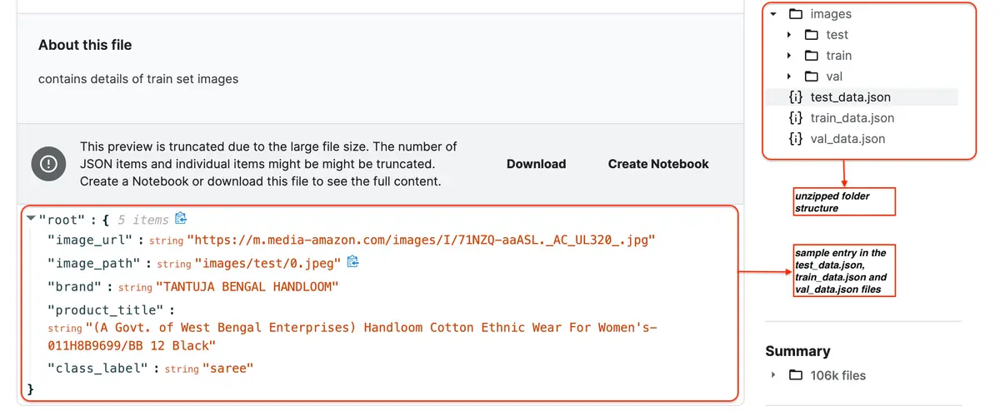
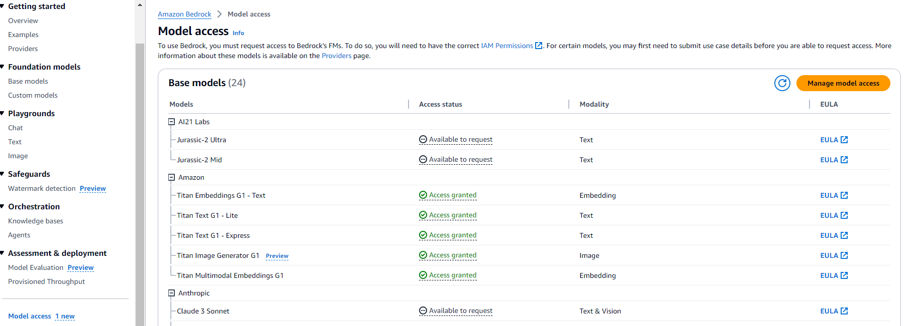
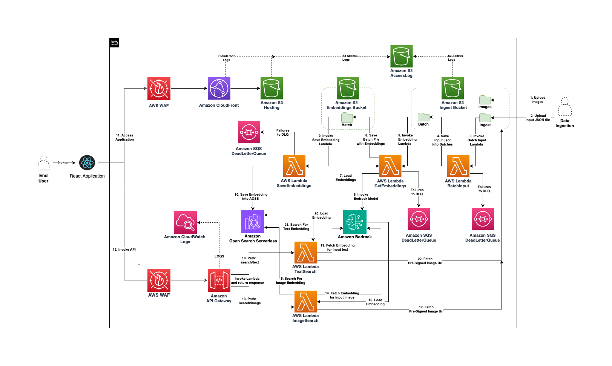
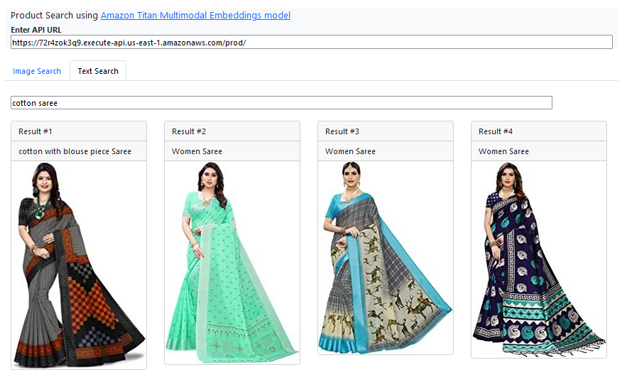

# amazon-titan-multimodal-embeddings

## Deploy the application
### Prerequisite

- Install [Nodejs](https://nodejs.org/en/download/) Latest LTS Version. (Project uses Nodejs 20.11.0 and npm 10.2.4)
- Install [Yarn](https://yarnpkg.com/getting-started/install)
- Install [cdk](https://docs.aws.amazon.com/cdk/v2/guide/getting_started.html#getting_started_install)
- Data setup. Download the [Indo Fashion dataset from Kaggle](https://www.kaggle.com/datasets/validmodel/indo-fashion-dataset) and unzip the data. Here's how the folder structure and the entry in the JSON files look like:
 
- Install docker [docker](https://docs.docker.com/engine/install/)

### Bedrock titan multimodal access

   

### Backend

- Clone this repository to your local computer.
- In the terminal, from the backend folder execute `yarn install` to install all dependencies.
- Update the cdk.json - allowedip with the ip-address of your machine, this whitelists the source ip-address to allow traffic into API-Gateway.
- Ensure that your docker daemon is running
- Run `docker ps`
- Make sure you set your aws credentials (AWS_ACCESS_KEY_ID, AWS_SECRET_ACCESS_KEY, AWS_SESSION_TOKEN)
- Run `cdk bootstrap`
- Ensure that you get Titan MultiModal access in Bedrock. Attached screenshot in project_asset for reference
- Run `cdk deploy` 

### Data Ingestion
- Ensure images are uploaded in S3 bucket  /ingest/images
- Browse to the folder where you unzipped data downloaded from Kaggle
- aws s3 cp --recursive .\images\test\ s3://backendstack-s3constructingestbucket680f5e47-g5jvbbthq3h1/images/ (windows)
- Upload json data files in S3 bucket  /ingest/data
- aws s3 cp test_data.json s3://backendstack-s3constructingestbucket680f5e47-g5jvbbthq3h1/data/test_data.json (windows)

### Frontend
- From the frontend folder, run `yarn install` to install the frontend dependencies.
- Run `yarn start` to launch the react application locally from the browser. 
- Open [http://localhost:3000](http://localhost:3000) to view it in your browser.
- Enter the API endpoint URL created through the backend cdk deployment
- To deploy frontend browse to infra folder and run following commands
- Make sure you set your aws credentials (AWS_ACCESS_KEY_ID, AWS_SECRET_ACCESS_KEY, AWS_SESSION_TOKEN)
- Run `cdk bootstrap`
- Add S3 bucket name in `cdk.json`
-`loggingBucketName`: `backendstack-xxxx`
- Run `cdk deploy`
- URL will be printed as output in the terminal to access frontend

## Architecture

## Application Features
### Product Image Search
  * Enter the API endpoint URl, click on `Find Similar Products` to view results based on image search. Alternatively you could upload new image by clicking `Change Product` option and performing a search.

    

### Product Text Search
  * Click on `Text Search` tab, enter a brief description of the product and click enter.

    

## Cleanup
- In the terminal, from the backend folder, run the `cdk destroy` command to remove the aws resources.
