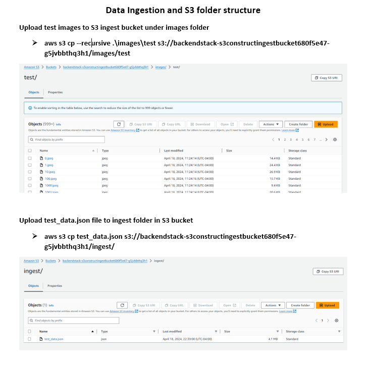

# Multimodal search using [Amazon Titan Multimodal Embeddings](https://aws.amazon.com/bedrock/titan/)
 Amazon Titan Multimodal Embeddings helps you build more accurate and contextually relevant multimodal search and recommendation experiences for end users. Multimodal refers to a system’s ability to process and generate information using distinct types of data (modalities). With Titan Multimodal Embeddings, you can submit text, image, or a combination of the two as input. The model converts images and short English text up to 128 tokens into embeddings, which capture semantic meaning and relationships between your data. By default, Titan Multimodal Embeddings generates vectors of 1,024 dimensions, which you can use to build search experiences that offer a high degree of accuracy and speed.

## Solution
The search application shared in this solution will allow an end user to search for products by submitting text and image as input. The search application will use semantica similarity to find closely related products using Amazon Titan Multimodal Embeddings LLM. As shown below, the left side of the user interface allows an end user to pick a reference image and text that describes additional attributes used for searching the product database.

## Deploy the application
### Prerequisite

- Install [Nodejs](https://nodejs.org/en/download/) Latest LTS Version. (Project uses Nodejs 20.11.0 and npm 10.2.4)
- Install [cdk](https://docs.aws.amazon.com/cdk/v2/guide/getting_started.html#getting_started_install)
- Install [aws cli](https://docs.aws.amazon.com/cli/latest/userguide/getting-started-install.html)
- Install docker [docker](https://docs.docker.com/engine/install/)
- Data setup: Download the [Indo Fashion dataset from Kaggle](https://www.kaggle.com/datasets/validmodel/indo-fashion-dataset) and unzip the data. Here's how the folder structure and the entry in the JSON files look like:
 

### Bedrock titan multimodal access

   

### Backend

- Clone this repository to your local computer.
- In the terminal, from the backend folder execute `corepack enable` and `yarn install` to install all dependencies.
- Update the cdk.json - allowedip with the ip-address of your machine, this whitelists the source ip-address to allow traffic into API-Gateway.
- Ensure that your docker daemon is running
- Run `docker ps`
- Make sure you set your aws credentials (AWS_ACCESS_KEY_ID, AWS_SECRET_ACCESS_KEY, AWS_SESSION_TOKEN)
- Optionally, run `cdk bootstrap` 
- Ensure that you get Titan MultiModal access in Bedrock. Attached screenshot in project_asset for reference
- Run `cdk deploy` 

### Data Ingestion
- Browse to the folder where you unzipped the downloaded data from Kaggle
- Use following aws cli command to upload images
`aws s3 cp --recursive .\images\test s3://backendstack-s3constructingestbucket680f5e47-g5jvbbthq3h1/images/test`
- The data inside the data file called `test_data.json` is stored in [JSON Lines text file format](https://jsonlines.org/)
- Use a JSONL to JSON conversion tool to convert the data file to JSON format. You can use [JSONL Converter](https://marketplace.visualstudio.com/items?itemName=F-loat.jsonl-converter) Visual Studio Code extension to perform this conversion.
- Upload the converted JSON data file to the ingest S3 bucket
`aws s3 cp test_data.json s3://backendstack-s3constructingestbucket680f5e47-g5jvbbthq3h1/ingest/`

The ingestion bucket will look like the following image after a successful upload process 

### Frontend
- From the frontend folder, run `yarn install` to install the frontend dependencies.
- Run `npm run build` to build the frontend assets
- To deploy frontend browse to infra folder `cd infra` and run following commands
- Make sure you set your aws credentials (AWS_ACCESS_KEY_ID, AWS_SECRET_ACCESS_KEY, AWS_SESSION_TOKEN)
- Add S3 log bucket name in `cdk.json`
-`loggingBucketName`: `backendstack-xxxx`
- Run `cdk deploy`
- Navigate to the URL printed as output in the terminal to access frontend
- Enter the API endpoint URL created through the backend cdk deployment
- Upload a picture in the search panel to find semantically similar images 
   
### Local Development
- From the frontend folder, run `yarn install` to install the frontend dependencies.
- Run `npm run build` to build the frontend assets
- Run `yarn start` to launch the react application locally from the browser. 
- Open [http://localhost:3000](http://localhost:3000) to view it in your browser.
- Enter the API endpoint URL created through the backend cdk deployment

## Architecture

## Application Features
### Product Image Search
  * Enter the API endpoint URl, click on `Find Similar Products` to view results based on image search. Alternatively you could upload new image by clicking `Change Product` option and performing a search.

    

## Cleanup
- In the terminal, from the frontend/infra folder, run the `cdk destroy` command to remove frontend aws resources. Browse back to backend folder, run the `cdk destroy` to remove backend resources.
